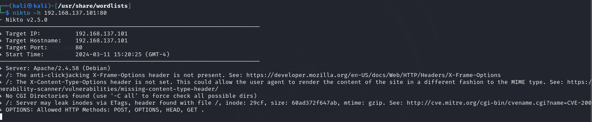

# Securité et visualition des données - Challenge 2024


## Présentation
**Machine locale** : 
-   ip : 192.168.137.95
-   system : MacOS

**Machine linux hebergeant iptables** : 
-   @ip : 192.168.137.101
-   user : aethelwulf
-   distribution : kali linux
  
Ce challenge a pour but de relier des notions de sécurité et d'analyse de données. Le but est de capturer des connexions ou des tentatives de connexions dans notre système d'information. Ces connexions seront journalisées (logs) et enregistrées pour ensuite faire une analyse sur des eventuelles attaques.<br> 
Pour ce faire, 2 solutions s'offrent à nous : 
- [Solution 1 ](#rsyslog) ==>  <a href="https://www.rsyslog.com/doc/index.html" target=_blank> Rsyslog</a> + <a href="https://www.syslog-ng.com/technical-documents/list/syslog-ng-open-source-edition/3.38">Syslog-ng</a>
- [Solution 2 ](#filebeat)==> ELK + Filebeat.  (<a href="https://www.elastic.co/fr/beats/filebeat" target=_blank>Documentation ELK</a>) 
  


## <a name="rsyslog"></a>1. Partie Syslog-ng et Rsyslog
**Architecture**

La journalisation se fait grâce à des règles [iptables](#iptables) déjà fournies. Les logs sont enregistrés dans un fichier */var/log/sise.log*. Puis ils sont envoyés vers un service docker grâce à rsyslog. Ces configurations sont faites au niveau d'une machine Kali linux.<br>
Trois conteneurs docker sont mis en place pour réceptionner, stocker et visualiser les logs. 

### 1.1 On monte nos conteneurs docker
Préseentation de nos 3 conteneurs 

  ***Conteneur 1*** : Syslog-ng / ip = 172.17.0.2 <br>
  Il nous permet de réceptionner et de filtrer les logs. L'image *syslog-challenge* est construite à l'aide d'un fichier DockerFile en local.

  ```docker
  docker run --name syslog-d-2024  -itd -p 22:22 -p 514:514  syslog-challenge
  ```

  ***Conteneur 2*** : <a name="mariadb"></a>MariaDB / ip = 172.17.0.3 <br>
  Il nous sert de base de données pour stocker nos données filtrées grâce à syslog-ng.
  ```docker
  docker run --name ma-mariadb -e  MARIADB_ROOT_PASSWORD=mypass123 -d -p 3306:3306 mariadb:10.6.4
  ```


  ***Conteneur 3*** : PhpMyAdmin / ip = 172.17.0.4<br>
  Il nous permet de visualiser nos données sur un navigateur web.
  ```docker
  docker run --name mon-phpmyadmin  -d --link ma-mariadb:db -p 8081:80 phpmyadmin
  ```


### 1.2 Condfiguration dans la machine kali linux
________________________________________________________________
#### <a name="iptables"></a> 1.2.1 Configuration iptables :
**Consignes**

1. Règles iptables : On met bien les règles iptables fournies dans le dossier du projet.


2. Les cinq ports de destination Tcp les plus utilisés sur les log Iptables Cloud et non présents dans le configuration Iptables sont :  443,22,80,23,445  


3. Ouverture des ces 5 ports avec netcat : 
  ```bat
  sudo nc -l -p 443 &
  sudo nc -l -p 445 &
  sudo nc -l -p 80 &
  sudo nc -l -p 23 &
  sudo nc -l -p 22 & 
  ```


4. Configuration Syslog-ng à l’aide des fichiers syslog-ng.conf et rsyslog.xml :
fichier 'syslog-ng.conf'


fichier rsyslog.xml


5. Autorisation des connexions SSH venant de l'administrateur et limitation des autres
   SSH admin ``iptables -A INPUT -p tcp -s 192.168.137.95 --dport 22 -m conntrack --ctstate NEW,ESTABLISHED -j ACCEPT ``
   limiter les autres connexions SSH 
```bat
iptables -A INPUT -p tcp --syn --dport 22 -m connlimit --connlimit-above 100 -m limit --limit 30/hour --limit-burst 1 -j ACCEPT
```
```bat
iptables -A INPUT -p tcp --syn --dport 22 -m connlimit --connlimit-above 30 -j DROP
```

Après avoir ajouté les règles demandées, on obtient ce fichier avec toutes les règles iptables finales :


#### 1.2.2 Configuration Rsyslog
on ajoute la configuration de rsyslog en spécifiant l'adresse de notre machine locale : 192.168.137.95. <br>
La capture ci dessous montre que les logs contenant la chaine de caractères **"RULE="** sont enregistrés dans le fichier *'/var/log/sise.log'* et sont aussi envoyés via le port 514 vers la machine locale (192.168.137.95) où nos 3 conteneurs tournent.

Fichier */etc/rsyslog.d/challenge.conf*


- On démarre le service rsyslog  : 
  ```bat
  systemctl start rsyslog
  ```

- On fait ensuite une capture réseau des trames 
  ```bat
  tcpdump -vvttttnn -XX dst port 514
  ```

### 1.3 Configuration de notre conteneur syslog
________________________________________________________________

Après avoir lancé le conteneur syslog avec la commande
```bat 
docker exec -it syslog-d-2024 bash
```
on modifie le fichier de conf *'/etc/syslog-ng/syslog-ng.conf'* en ajoutant l'adresse ip du conteneur MariaDB en tant que host. Logs_fw est le nom de notre base de données.
```SQL
mysql -h 172.17.0.3 -u root -pmypass123 Logs_fw > /dev/null 
```
L'adresse ip *'172.17.0.3`* fait référence à notre conteneur [mariaDB](#mariadb).<br>
L'image ci-dessous montre la config syslog-ng. Les logs réceptionnés sont parsés et certaines informations **(date,ip-src, ip-dst, protocole, port de destination, policyId,action, interface)** sont enregistrés dans la base de donnés.<br>
Les logs bruts sont sauvegardés dans le fichier *'brut.log'* et dans le fichier *'firewall.csv'* de manière semi-structuré. 


On demarre ensuite le service syslog avec la commande 
```shell
/etc/init.d/syslog-ng start
```
Et enfin on fait une capture réseau pour voir les paquets envoyés par la machine kali.
```bat
tcpdump -vvttttnn -XX dst port 514
```


- Contenu du fichier brut.log :


- Contenu du fichier firewall.csv : Les logs sont bien parsés et enregistrer dans le fichier 'firewall.csv'


- Contenu de notre base de données mariaDB : 
  


### 1.4 Alimentation des données
________________________________________________________________
**Consignes**
1. Connexions licites  : Pour faire des connexions licites on exécute le script ci-dessous pendant quelques minutes depuis la machine de l'administrateur (machine local) qui est autorisé à se connecter par ssh.
```bash
#!/bin/bash

# Nom du fichier = journalisation.sh

# Connexion HTTP (Port 80)
curl -s http://192.168.137.101 >> /var/log/aethelwulf.log

# Connexion Telnet (Port 23)
telnet 192.168.137.101 >> /var/log/aethelwulf.log

# Connexion SSH (Port 22)
ssh aethelwulf@192.168.137.101 >> /var/log/aethelwulf.log

# Connexion HTTPS (Port 443)
curl -s http://192.168.137.101 >> /var/log/aethelwulf.log
```


2. Balayage de tous les ports:
   `` nmap 192.168.137.101 -p- ``


#### 1.5 Mode Attaque !!
- 1. Balayage furtif avec 10 adresses différentes via une seule commande :
```bat
nmap 192.168.137.101 -D  10.0.0.1, 192.168.4.1 , 172.156.2.26 , 192.168.1.0 , 10.10.1.101 , 89.89.56.2 , 28.12.15.20 , 10.172.11.2 , 194.25.56.2 , 172.5.2.8 
```


- 2. Balayage furtif avec 10 adresses aléatoires :
```bat
nmap 192.168.137.101 -D RND:10
```


- 3. Balayage simple fragmenté et en ACK.
```bat
nmap -f --scanflags ACK 192.168.137.101
```  

- 4. Balayage furtif via un zombi
 
**Etape 1 : trouver un zombi**
```bat
nmap --script=ipidseq -p 80 -T5 -v reseau_cible/24
```

**Etape 2 : Choisir un zombi** <br>
  Un zombi est distingué par le champ *'ipidseq : Incremental!'*
  <!--  -->

**Etape 3 : lancer le scan**
```bat
nmap -sI 159.84.146.187 192.168.137.101
```


- 5. Balayage furtif avec des adresses utilisées dans le plan d’adressage en cours d’utilisation 
(159.Y/X/X.).

```bat
nmap -D 159.Y/X/X 192.168.137.101
```

- 6. Balayage avec un spoof-mac d’une adresse active sur le plan d’adressage en cours
  
**Etape 1 : trouver une adresse mac**
```bash
arp -a
``` 

**Etape 2 : lancer le spoof-mac**
```bat
nmap -T4 --spoof-mac adresse_mac 192.168.137.101
```

<!-- SELECT * FROM `FW` WHERE ipsrc="192.168.137.12" AND dstport="21" OR dstport="20";" -->

- 7. Attaque par brute force sur le service Ftp.

  Script python pour générer la wordlist import itertools
  ```python
  characters = 'abcdefghijklmnopqrstuvwxyz'
  words = [''.join(i) for i in itertools.product(characters, repeat=4)]

  with open('four_character_dictionary.txt', 'w') as f:
      for word in words:
          f.write(word + '\n')
  ```
  Commande pour brute force avec hydra: 
  ```bat
  hydra -l aethelwulf -P /usr/share/wordlists/four_character_dictionary.txt ftp://192.168.137.101
  ```
  Les logs brute force dans la BD
    

- 8. Enumération dirbuster
```bat 
gobuster dir -u http://192.168.137.101/ -w /usr/share/wordlists/small.txt 
```

- 9. Attaque web via Nikto ou ZAP 
```bat
nikto -h 192.168.137.101:80
```



- 10. Balayage des 100 ports les plus utilisés avec un délai d’une seconde par ports interrogés.
```bat
nmap -p $(seq -s , 1 100) --max-rate=1 192.168.137.167
```


- 11. Test de scripts de type nmap orientés « http » ,« ftp » et « ssh »
```bat
nmap --script=http-enum 192.168.137.101
nmap --script=ftp-anon 192.168.137.101
nmap --script=ssh-brute 192.168.137.101
```


## <a name="rsyslog"></a>2. Partie : Filebeat + ELK
Architecture :

La journalisation avec ELK et filebeat est plus légère que celle avec rsyslog/syslog-ng. Les règles iptables étant ajoutées, nous avons besoin d'installer filebeat et logstash dans notre VM kali linux. <a href="https://www.elastic.co/guide/en/beats/filebeat/current/configuring-howto-filebeat.html" target="_blank">Documentation ELK filebeat</a>.<br>
Notre environnement est constitué de filebeat et logstash qui sont installés dans notre VM kali et de deux conteneurs elasticsearch et kibana qui tournent dans notre machine locale.

- Filebeat permet de capturer les logs qui se trouvent dans le fichier *'/var/log/sise.log'* et les transmet à logstash qui écoute sur le port 5044.

- Logstash est chargé de parser les logs de manière structurée et de les transmettre à nos services elasticsearch + kibana (ELK) qui tournent sur des conteneurs docker. 

- ELK nous permet de visualiser les logs en temps réels et de les représenter sur des graphes.

### 2.1 Installations de filebeat et de logstash
Nous allons devoir exécuter les commandes ci-dessous pour bien faire tourner filebeat.
```bat
# pre-config

sudo apt-get install apt-transport-https gpg

wget -qO - https://artifacts.elastic.co/GPG-KEY-elasticsearch | sudo gpg --dearmor -o /etc/apt/trusted.gpg.d/elastic.gpg

echo "deb https://artifacts.elastic.co/packages/8.x/apt stable main" | sudo tee -a /etc/apt/sources.list.d/elastic-8.x.list

--------------------------------------------------

# install filebeat
sudo apt-get update && sudo apt-get install filebeat

--------------------------------------------------
#install logstash
sudo apt-get install logstath

export PATH=$PATH:/usr/share/logstash/bin/
```
### 2.2 Configuration de filebeat
Après l'installation de filebeat, nous ajoutons les lignes suivantes dans le fichier **filebeat.yml**
```yml
filebeat.inputs:
- type: log
  paths:
    - /var/log/sise.log

output.logstash:
  hosts: ["127.0.0.1:5044"]
```

### 2.3 Configuration de logstash
Dans un fichier  **myconf.conf** que nous avons créé, nous mettons le contenu ci-dessous. 
```shell
input {
    beats {
        port => "5044"
    }
}
filter {
    grok { 
        match => { "message" => "%{TIMESTAMP_ISO8601:timestamp} %{SYSLOGHOST:sysloghost} kernel: \s*\[%{DATA:kern}\]\s* ACTION=%{DATA:action} RULE=%{INT:rule} IN=%{WORD:in} OUT=%{DATA:null} MAC=%{DATA:mac} SRC=%{IP:srcip} DST=%{IP:dstip} LEN=%{INT:len1} TOS=%{WORD:tos} PREC=%{WORD:prec} (?:TTL=%{WORD:prec})? ID=%{INT:ID} (?:%{DATA:DF})?PROTO=%{WORD:proto} SPT=%{INT:src_port} DPT=%{INT:dst_port} (?: LEN=%{INT:len2})?(?: WINDOW=%{INT:window})?(?: RES=%{INT:res})?(?: URGP=%{INT:urgp})?(?: RES=%{WORD:res})?(?: %{WORD:ack})?"} 
    }
}
output {
   elasticsearch {
      hosts => [ "192.168.137.95:9200" ]
	    action => "index"
	    index => "sise"
    }
    stdout {}
}
```
Ce fichier prend en entrée les logs que le logstash reçoit sur le port 5044. Il les filtre ensuite à l'aide de <a href="http://" target="_blank">grok</a>. 

Le contenu du filtre grok dépend des logs. Nous vous recommendons d'utiliser des outils de filtre grok en ligne pour obtenir un bon filtre des données.

Le fichier envoie la sortie (les logs filtrés et structurés) vers un service elasticsearch qui tourne dans un conterneur au niveau de la machine locale (192.168.137.95). 


### 2.4 Démarrage des services elasticsearch et kibana
Elasticsearch :
```docker
docker run -itd -p 9200:9200 -p 9300:9300 dck_elastic:latest
```

kibana :
```docker
docker run -itd -p 5601:5601 dck_kibana:latest 
```
dck_elastic et dck_kibana sont des images dockers que nous installés grâce à un fichier DockerFile.

**DockerFile de elasticsearch**
```docker
FROM ubuntu

RUN apt update
RUN apt-get -y install openssh-server iptables 
RUN apt install rsyslog -y
RUN apt install apt-transport-https gnupg2 uuid-runtime pwgen curl dirmngr -y
RUN apt install openjdk-11-jre-headless -y
RUN apt install sudo vim wget file  -y
RUN apt update
RUN curl -fsSL https://artifacts.elastic.co/GPG-KEY-elasticsearch |sudo gpg --dearmor -o /etc/apt/trusted.gpg.d/elastic.gpg

RUN echo "deb [signed-by=/etc/apt/trusted.gpg.d/elastic.gpg] https://artifacts.elastic.co/packages/7.x/apt stable main" | sudo tee -a /etc/apt/sources.list.d/elastic-7.x.list
RUN apt update -y
RUN apt list --upgradable
RUN apt install elasticsearch -y
RUN sed -i".bak" 's/^\#PermitRootLogin prohibit-password/PermitRootLogin Yes/' /etc/ssh/sshd_config
EXPOSE 22
EXPOSE 8888
EXPOSE 9200
EXPOSE 9300
COPY elasticsearch.yml /etc/elasticsearch/
COPY demo.sh /entrypoint.sh
RUN chown root.elasticsearch /etc/elasticsearch/elasticsearch.yml
RUN chmod +x /entrypoint.sh
RUN echo "root:toto" | chpasswd
CMD service elasticsearch start
ENTRYPOINT ["/entrypoint.sh"]
#history > histo-ok.txt
```

**DockerFile de kibana**
```docker
FROM ubuntu

RUN apt update
RUN apt-get -y install openssh-server iptables 
RUN apt install rsyslog -y
RUN apt install apt-transport-https gnupg2 uuid-runtime pwgen curl dirmngr -y
RUN apt install openjdk-11-jre-headless -y
RUN apt install sudo vim wget file  -y
RUN apt update
RUN curl -fsSL https://artifacts.elastic.co/GPG-KEY-elasticsearch |sudo gpg --dearmor -o /etc/apt/trusted.gpg.d/elastic.gpg

RUN echo "deb [signed-by=/etc/apt/trusted.gpg.d/elastic.gpg] https://artifacts.elastic.co/packages/7.x/apt stable main" | sudo tee -a /etc/apt/sources.list.d/elastic-7.x.list
RUN apt update -y
RUN apt list --upgradable
RUN apt install kibana logstash -y
RUN sed -i".bak" 's/^\#PermitRootLogin prohibit-password/PermitRootLogin Yes/' /etc/ssh/sshd_config
EXPOSE 22
EXPOSE 8888
EXPOSE 5601
COPY kibana.yml /etc/kibana/
COPY demo.sh /entrypoint.sh
RUN chown root.kibana /etc/kibana/kibana.yml
RUN chmod +x /entrypoint.sh
RUN echo "root:toto" | chpasswd
#CMD service kibana start
ENTRYPOINT ["/entrypoint.sh"]
#history > histo-ok.txt
```
Une fois ces deux conteneurs *Up*, nous démarrons le kibana en "interactive terminal" et nous modifions le fichier */etc/kibana/kibana.yml* pour ajouter l'ip d'elasticsearch pour que kibana et élasticsearch puisse bien communiquer.
l'ip d'lastic est le 172.17.0.3
.

✅ elasticsearch ==> localhost:9200 👍

✅ kibana ==> localhost:5601 👍


### 2.5 Démarrage du service logstash
Retournons dans notre VM kali pour démarrer le service logstash. Nous allons exécuter les commandes suivantes dans cet ordre.
```bash
# Ajout de la source de données filebeat
sudo filebeat -e -c /etc/filebeat/filebeat.yml --strict.perms=false -d "publish"

# lancer le service logstash
service logstash start

## tester si les config logstash sont OK
/usr/share/logstash/bin/logstash -f myconf.conf --config.test_and_exit

## Si le test sont OK, on démarre logstash qui se rafraichit de manière autmatique
bin/logstash -f myconf.conf --config.reload.automatic
```

Si nous allons ensuite sur ELK, nous verrons l'index **sise** au niveau du "stack management", une fois l'avoir ajouté, nous verrons les logs du patten **sise** au niveau de "discover"

Ci dessous quelques données que nous avons choisi d'afficher.


Nous pouvons ensuite créer un Dashboard qui ressemble à ça.
